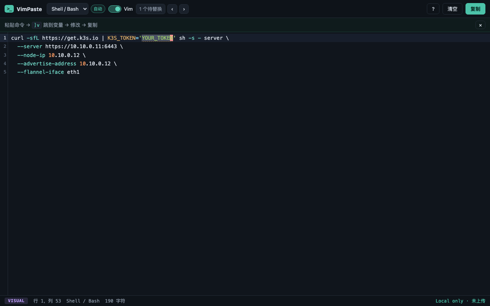
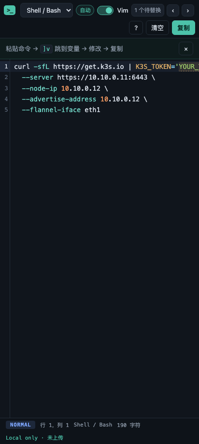

# VimPaste

**为 AI 生成命令准备的、支持 Vim 的临时代码编辑器。**

AI 返回的安装命令往往很长，中间夹着 `YOUR_TOKEN`、`<IP_ADDRESS>`、`${PASSWORD}` 之类需要替换的内容。直接在服务器终端里改很痛苦：光标难定位、续行符和引号容易弄坏、没有语法高亮。VimPaste 把这一步搬到浏览器里：**粘贴 → 自动识别 → `]v` 跳到变量 → 用 Vim 键位替换 → 一键复制回终端**。全部处理都在浏览器本地完成，内容不上传。





- 在线演示：<https://kaiwenyao.github.io/vimpaste/>
- 仓库：<https://github.com/kaiwenyao/vimpaste>

## 功能

- **编辑器**：CodeMirror 6，行号、当前行高亮、括号匹配、搜索（`Ctrl/Cmd+F`）、语法高亮；长行横向滚动，不做任何自动格式化，粘贴什么复制的就是什么。
- **编辑器键位（设置中切换）**：普通编辑器 / **Vim**（默认）/ **Emacs**（Ctrl-a/e/k/b/f 等 readline 键位）；Vim 支持 Normal / Insert / Visual / Command-line，`hjkl`、`w/b/e`、`0/$`、`gg/G`、`f/t`、`i/a/o`、`x/r`、`d/c/y` 与文本对象、`/`、`?`、`n/N`、`u`、`Ctrl-r` 等，底部状态栏实时显示当前模式。
- **占位符识别与导航**：识别 `YOUR_TOKEN`、`REPLACE_ME`、`<TOKEN>`、`<IP_ADDRESS>`、`${PASSWORD}`、`$YOUR_TOKEN`、`*_HERE` 及引号中的占位内容；工具栏显示待替换数量，提供鼠标可用的上一个/下一个按钮；Vim Normal 模式下 `]v` / `[v` 跳转并选中占位文本，直接替换。
- **语言自动识别**：Shell 特征优先（Shebang、管道进 `sh`、`sh -s -`、续行反斜杠、环境变量赋值、常见命令），再以 highlight.js 在受限候选语言（Shell/Bash、PowerShell、YAML、JSON、JavaScript、TypeScript、Python、SQL、Dockerfile、Nginx、纯文本）内评分；语言包按需加载，不进首屏包；手动选择后不再被自动覆盖。
- **复制与反馈**：一键复制编辑器全部内容（`Ctrl/Cmd+Enter` 或按钮），Clipboard API 不可用时自动降级，成功后给出明确提示。
- **设置面板**：工具栏 ⚙ 打开，可切换键位模式、编辑器字体大小（12–20px，即时生效）与颜色主题，选择会记住（非敏感偏好）。
- **粘贴历史**：工具栏时钟按钮打开侧栏，界面参考常见的 AI 对话历史列表。内容停止编辑约 1.5 秒后自动保存快照（复制时立即保存），条目取首行作为标题，按「今天 / 昨天 / 7 天内 / 30 天内 / 更早」分组，支持搜索、点击恢复到编辑器、悬停删除单条与二次确认清空全部。仅保存在本浏览器 localStorage，不上传；最多 30 条、单条上限 10 万字符；可在面板中关闭「自动保存」（关闭即清空）。
- **颜色主题**：深色（默认）/ 浅色 / 高对比，工具栏或设置面板中均可切换。
- **隐私**：无后端、无账号、无分析统计；编辑内容只在浏览器本地处理、不写入 URL、IndexedDB、Service Worker 缓存或日志。唯一的本地持久化是偏好设置与可选的粘贴历史（默认开启，可一键关闭并清空）；生产构建注入 CSP（仅限同源资源）。
- **PWA**：可安装，静态资源缓存后断网可用核心编辑功能，不缓存编辑内容；发布新版本后页面会出现「发现新版本」提示条，点击「立即刷新」完成更新（不会自动重载，避免丢失未复制的内容）。

## 本地开发

需要 Node.js 20.19+（推荐 22/24）。

```bash
npm install
npm run dev        # 开发服务器
```

## 测试命令

```bash
npm run lint          # ESLint
npm run typecheck     # TypeScript 严格模式类型检查
npm test -- --run     # Vitest 单元测试（检测规则、复制一致性、持久化、组件可访问性）
npm run build         # 类型检查 + 生产构建 + 构建产物与包体积检查
npm run test:e2e      # Playwright 端到端（K3s 核心流程、Vim 操作、粘贴历史、桌面/移动视口、离线）
```

首次运行端到端测试前需要安装浏览器：`npx playwright install chromium`。

## 构建与部署

`npm run build` 产出 `dist/`（`base` 为 `/vimpaste/` 仓库子路径）。推送到 `main` 后 GitHub Actions 自动执行质量检查并部署到 GitHub Pages（`.github/workflows/deploy.yml`），部署目标为 Pages 的「GitHub Actions」来源。也可以手动 `npm run build && npm run preview` 在本地验证生产构建。

## 隐私说明

- 编辑、语言识别、占位符标记、语法高亮、复制全部在浏览器本地完成，没有后端服务器。
- 编辑内容不会写入 URL、sessionStorage、IndexedDB、日志，也不发送到网络。
- **粘贴历史**（默认开启）会把编辑内容快照保存在本浏览器 localStorage（键 `vimpaste.history.v1`），便于下次查看和恢复；可在历史面板中搜索、删除单条或清空全部，也可以关闭「自动保存」（关闭即清空，之后不再写入）。
- 另在 localStorage 保存五个非敏感偏好：键位模式、字体大小、首次提示是否已关闭、颜色主题、粘贴历史开关。
- 界面右下角固定显示 `Local only · 未上传`。
- 注意：浏览器扩展或操作系统级剪贴板同步不在本应用控制范围内；在本机共用浏览器账号的其他人可以看到历史记录，敏感内容请使用后清空。
- 详细说明见 [docs/privacy.md](docs/privacy.md)。

## 快捷键

| 按键             | 作用                                                                |
| ---------------- | ------------------------------------------------------------------- |
| `]v` / `[v`      | Vim Normal 模式下跳到下一个/上一个占位符（并选中，按 `c` 即可替换） |
| `Ctrl/Cmd+Enter` | 复制全部内容（编辑器聚焦时）                                        |
| `Ctrl/Cmd+F`     | 打开搜索面板                                                        |
| `/` 与 `?`       | Vim 搜索；`n` / `N` 下一个/上一个匹配                               |
| `u` / `Ctrl+r`   | 撤销 / 重做                                                         |
| `Esc`            | 返回 Normal 模式 / 关闭对话框                                       |

键位模式在设置（⚙）中切换：Vim 模式由 Vim 处理按键；普通编辑器模式按系统标准行为处理（`Tab` 可移出编辑器）。浏览器刷新、关闭标签页等系统快捷键不受影响。

## License

[MIT](LICENSE)
